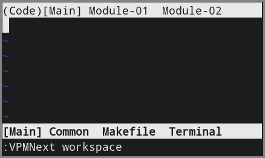
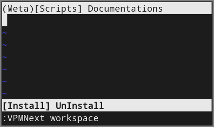
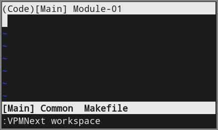

# Introdução
Este plugin permite o planejamento e navegação de arquivos de forma independente da forma com que o Vim/Neovim organiza os arquivos.

O uso deste plugin só se justifica se houver a necessidade de mapear vários arquivos ao mesmo tempo. Considere o exemplo onde se quer mapear o seguinte projeto C:

```console
.
├── bin
│   ├── install.sh
│   └── uninstall.sh
├── doc
│   ├── module-01.txt
│   └── module-02.txt
├── Makefile
├── readme.txt
├── src
│   ├── common.h
│   ├── main.c
│   ├── module-01.c
│   ├── module-01.h
│   ├── module-02.c
│   └── module-02.h
└── test
    ├── module-01.c
    ├── module-01.h
    ├── module-02.c
    └── module-02.h
```

Tanto o Vim quanto o Neovim (e editores de texto em geral) organizam os arquivos sendo abertos em uma lista circular, geralmente apresentados em abas separadas cujo o nome de cada aba faz alguma referência ao arquivo em questão. Algo como:

```console
|file-01.txt|file-02.txt|file-03.txt|...|last-file.txt|
```

o problema dessa abordagem quando estamos lidando com um projeto grande, como o exemplo acima, é que fica difícil de mapear todos eles ao mesmo tempo pelos seguintes motivos:

1) Categorias diferentes: código fonte, scripts, documentação, etc
2) Hieraquias diferentes: pastas e sub-pastas
3) Curta memória humana : Não conseguimos lembrar muitas  posições na lista
4) Consome a largura da tela

isso ocorre porque ao organizar os arquivos desta forma, estamos os organizando de forma linear, e consequentemente teremos apenas 1 (um) grau de liberdade de como dispor tais arquivos.

Portanto, a proposta do VPM é a de servir como a terceira mão que você nunca teve, ou seja, vai ajudá-lo a contornar o problema descrito.

# Como usar o VPM

O uso do VPM consiste das seguintes etapas:

1) Criar um ou mais meta-arquivos de projetos
2) Carregar um meta-arquivo
3) Acionar um comando do VPM

### Meta-arquivos
Considerando o projeto em C descrito na introdução, um possível arquivo de projeto seria o seguinte:

```text
workspace Code

  tab Main
    buff Main     : src/main.c
    buff Common   : src/common.c
    buff Makefile : Makefile
    term Terminal : bash

  tab Module-01
    buff  Source : src/module-01.c
    buff  Header : src/module-01.h
    buff TSource : test/module-01.c
    buff THeader : test/module-01.h

  tab Module-02
    buff  Source : src/module-02.c
    buff  Header : src/module-02.h
    buff TSource : test/module-02.c
    buff THeader : test/module-02.h

workspace Meta

  tab Scripts
    buff   Install : bin/install.sh
    buff UnInstall : bin/uninstall.sh

  tab Documentations
    buff README    : README.md
    buff Module-01 : doc/module-01.txt
    buff Module-02 : doc/module-02.txt
```

que produzirá o resultado 





Desta forma, o usuário será apresentado com as informações escritas no arquivos de projetos, porém em vez de eles serem apresentados de forma linear, o usuário terá a visão deles em 3 (três) graus de liberdade, por cada arquivo de projeto escrito, de forma que os arquivos ficarão dispostos em forma de árvore, onde cada galho representa uma hierarquia.

### Sintaxe para meta-arquivos
Todos os projetos deverão ser guardados dentro do diretório `.vpm/proj`. No exemplo acima eu criei o arquivo `.vpm/proj/myproj` contendo exatamente o conteúdo mostrado lá.

De uma forma geral, sintaxe `VPM` para os meta-arquivos possui 4 (quatro) palavras reservadas: "workspace", "tab", "buff" e "term"

* Palavra "workspace" : 

  workspace \<nome-do-workspace\>

* Palavra "tab" : 

  tab \<nome-da-aba\>

* Palavra "buff" : 

  buff \<nome-do-buffer\> : caminho/até/o/arquivo

* Palavra "term" : 

  term \<nome-do-terminal\> : \<commando-a-ser-executado\>

Algumas ressalvas:

1) cada instrução é dada em uma única linha
2) cada instrução pode ter espaçoes antes e entre palavras
3) os nomes das coisas podem ter qualquer caracte
4) se quiseres criar um terminal sem comandos, crie-o da seguinte forma: "term \<nome-do-terminal\> :". Perceba que deve conter o ":"

### Desativador de subestruturas
Para desativar uma subestrutura, podemos usar o operador "*" (asterísco) na frente da palavra reservada. O efeito disso é que a estrutura após "*", bem como as subestruturas daquela hierarquia não serão considerados ao carregar o arquivo de projeto. Pense nesta ação como uma forma de podar a árvore momentâneamente. No nosso exemplo:

```text
workspace Code

  tab Main
    buff Main     : src/main.c
    buff Common   : src/common.c
*   buff Makefile : Makefile
*   term Terminal : bash

  tab Module-01
    buff  Source : src/module-01.c
    buff  Header : src/module-01.h
    buff TSource : test/module-01.c
    buff THeader : test/module-01.h

* tab Module-02
    buff  Source : src/module-02.c
    buff  Header : src/module-02.h
    buff TSource : test/module-02.c
    buff THeader : test/module-02.h

* workspace Meta

  tab Scripts
    buff   Install : bin/install.sh
    buff UnInstall : bin/uninstall.sh

  tab Documentations
    buff README    : README.md
    buff Module-01 : doc/module-01.txt
    buff Module-02 : doc/module-02.txt
```

que por sua vez produzirá o seguinte:



No caso, as estruturas de nome:

1) Makefile  (buff)
2) Terminal  (term)
3) Module-01 (tab)
4) Meta (workspace)

foram desconectadas, ou podadas, ou ainda não carregadas.

# Comandos 
As funcionalidades do VPM são acessadas pelos seguintes comandos: 

```text
:VPMLoadProject
:VPMSaveDefault
:VPMEditProjects
:VPMTerminal
:VPMNext
:VPMPrev
```

Ou seja, em modo normal entre no modo de comando do Vim/Neovim aperdando **":"** e entre com um dos comandos acima.

## Comando _:VPMLoadProject_

### Argumentos: 
_Apenas 1 (um) e obrigatório. Completável com tab, que lista os arquivos dentro de `/path/to/project/.vpm/proj/`_

### Síntaxe: 
`:VPMLoadProject <nome-do-meta-arquivo>`

### Ação : 
_Carrega um meta-arquivo descritor de projeto localizado em `/path/to/project/.vpm/proj/<nome-do-meta-arquivo>`_

[comment]: --------

## Comando _:VPMSaveDefaultProject_

### Argumentos: 
_Apenas 1 (um) e opcional. Completável com tab, que lista os arquivos dentro de `/path/to/project/.vpm/proj/`._

_Se nenhum nome de meta-arquivo de projeto for escolhido, VPM salvará o projet carregado no momento._

### Síntaxe: 
`:VPMSaveDefaultProject <nome-do-meta-arquivo>`

### Ação : 
_Salva um meta-arquivo descritor de projeto localizado em `/path/to/project/.vpm/proj/<nome-do-meta-arquivo>` como projeto padrão a ser carregado ao iniciar o Vim/Neovim de dentro do diretório `/path/to/proj/`_

[comment]: --------

## Comando _:VPMEditProjects_
OBS: Funciona apenas no Neovim por enquanto.

### Argumentos: 
_0 (zero/nenhum)_ 

### Síntaxe: 
`:VPMEditProjects <enter>`

### Ação : 
_Abre um workspace temporário para a edição dos meta-arquivos de projetos presentes. Também cria um terminal em outra que permite o usuário fazer manipulações em seu projeto, compatíveis com as mudanças a serem feitas neste modo._

_Quando acionado de dentro do modo de edição de meta-arquivos, VPM retorna para o último buffer que estava em foco antes do comando ser acionado pela primeira vez (função toggle)._

_Se o meta-arquivo de projeto que corresponde ao projeto carregado por `:VPMLoadProject` for alterado, VPM aplicará as devidas mudanças._

_Um "* (asterísco)" será colocado na frente do nome do meta-arquivo carregado._

[comment]: --------

## Comando _:VPMTerminal_

### Argumentos: 
_0 (zero/nenhum)_ 

### Síntaxe: 
`:VPMTerminal <enter>`

### Ação : 
_Abre um terminal coringa que pode ser lançado de qualquer lugar e em qualquer momento._

[comment]: --------

## Comando _:VPMNext_

### Argumentos: 
_Apenas 1 (um) e obrigatório. Completável com tab, que lista dentre as 3 (três) possíveis estruturas iteráveis da árvore, sendo elas: "workspace", "tab" ou "buffer". Terminais também são considerados como buffers neste caso_

### Síntaxe: 
`:VPMNext <workspace-tab-buffer>`

### Ação : 
_Avança um elemento de mesma hierarquia na árvore do VPM._

[comment]: --------

## Comando _:VPMPrev_

### Argumentos: 
_Apenas 1 (um) e obrigatório. Completável com tab, que lista dentre as 3 (três) possíveis estruturas iteráveis da árvore, sendo elas: "workspace", "tab" ou "buffer". Terminais também são considerados como buffers neste caso._

### Síntaxe: 
`:VPMPrev <workspace-tab-buffer>`

### Ação : 
_Retorna um elemento de mesma hierarquia na árvore do VPM._

# Mapeamento de teclas (Mappings)

Nenhum mapeamento de tecla é feito por padrão. Porém eu sugiro o uso das seguintes teclas:

```text
 <espaco>: próximo buffer
m<espaco>: buffer anterior

 <tab>: próxima aba
m<tab>: aba anterior

 <ctrl-n>: próximo workspace
m<ctrl-p>: workspace anterior

mt : abre terminal coringa

<F9>  : salva projeto padrão
<F10> : Carrega novo projeto
<F12> : Entra em modo de edição de projeto
```

Atualmente os meus mapeamentos são o seguinte:

```vim
  nmap  <space> :VPMNext buffer<cr>
  nmap m<space> :VPMPrev buffer<cr>
  nmap  <tab>   :VPMNext tab<cr>
  nmap m<tab>   :VPMPrev tab<cr>
  nmap <c-n>    :VPMNext workspace<cr>
  nmap <c-b>    :VPMPrev workspace<cr>
  nmap mt       :VPMTerminal<cr>
  nmap <F9>     :VPMSaveDefaultProject<space>
  nmap <F10>    :VPMLoadProject<space>
  nmap <F12>    :VPMEditProjects<cr>
  nmap <F8>     :VPMDevTest<cr>
```

# Algumas observações

## set hidden
Se esta opção não estiver setada, um erro ocorrerá quando tentares passar de um buffer para outro caso o atual esteja modificado. Isso não é um bug, pois o Vim/Neovim foi construido dessa forma (ver `:help hidden`). Então, colocar em seu arquivo de configuração o seguinte

```vim
  set hidden
```

## showtabline=2
Esta opção deixa a barra de abas (tabline) sempre visível.

```vim
  set showtabline=2
```

## g:vpm_load_default
Esta opção desativa a função de carregar projetos por padrão quando setada com `0 (zero)`. O seu valor padrão é `1 (um).`

```vim
  let g:vpm_load_default = 1
```
